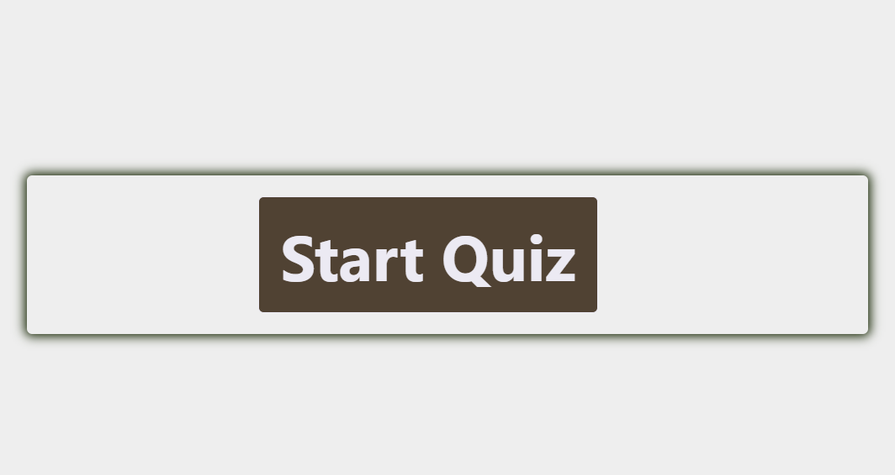
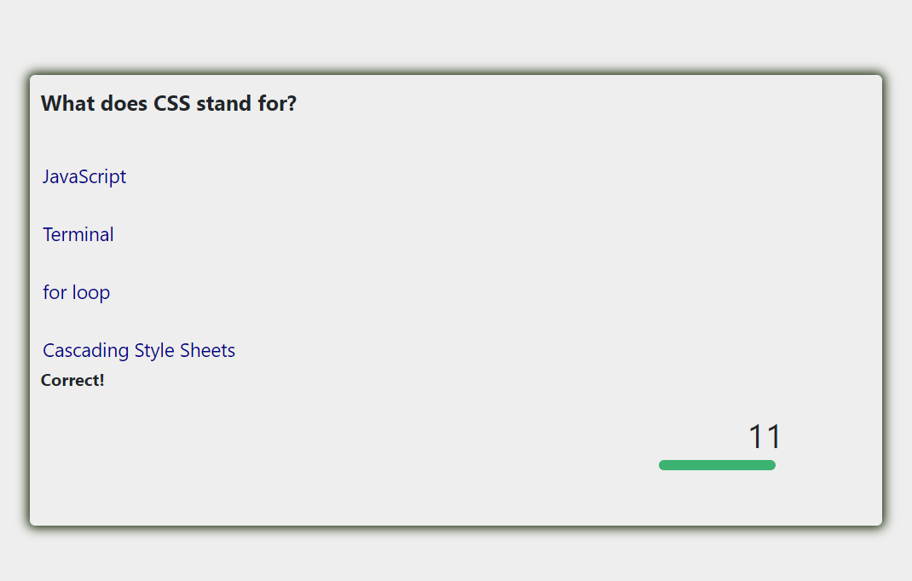
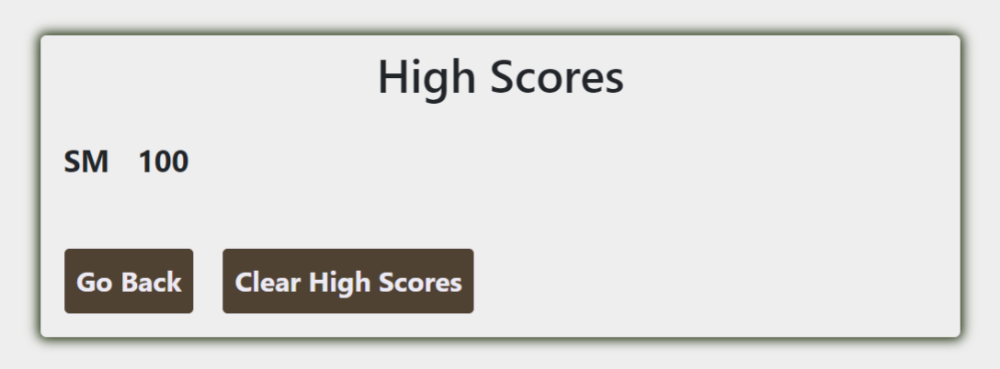

# CodingQuizApp
**This is a multiple choice quiz app.** It starts with a _start quiz_ button, and the quiz stars after the button is clicked. The quiz is timed. If the timer reaches zero, quiz stops and shows the score page. It will also tell you if the answer you pick is correct or wrong. 
This app is equipped with a _clear score_ button to clear the record as well as a go _back button_ for you to restart the quiz.

Here is the webpage link to the app: https://mushuyun.github.io/CodingQuizApp/

Here is a screen shot to show you how it looks.

